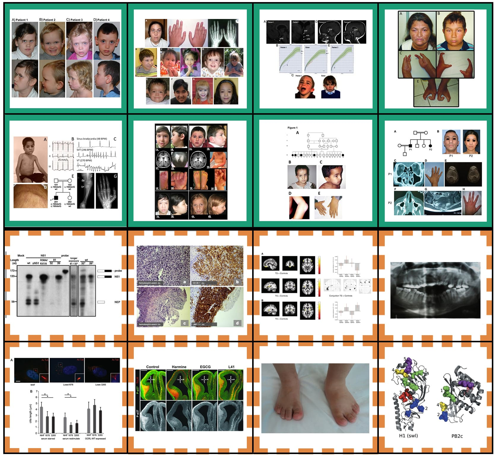

# mining_faces
Code and citations for Mining Faces from Biomedical Literature using Deep Learning

	

#### Row 1, Column 1
#### Row 1, Column 1
#### Row 1, Column 1
#### Row 1, Column 1
#### Row 1, Column 1
#### Row 1, Column 1
#### Row 1, Column 1
#### Row 1, Column 1
#### Row 1, Column 1
#### Row 1, Column 1
#### Row 1, Column 1
#### Row 1, Column 1
#### Row 1, Column 1
#### Row 1, Column 1
#### Row 1, Column 1
#### Row 1, Column 1
#### Row 1, Column 1
#### Row 1, Column 1
#### Row 1, Column 1
#### Row 1, Column 1
#### Row 1, Column 1
#### Row 1, Column 1
#### Row 1, Column 1
#### Row 1, Column 1
#### Row 1, Column 1
#### Row 1, Column 1
#### Row 1, Column 1
#### Row 1, Column 1
#### Row 1, Column 1
#### Row 1, Column 1
#### Row 1, Column 1