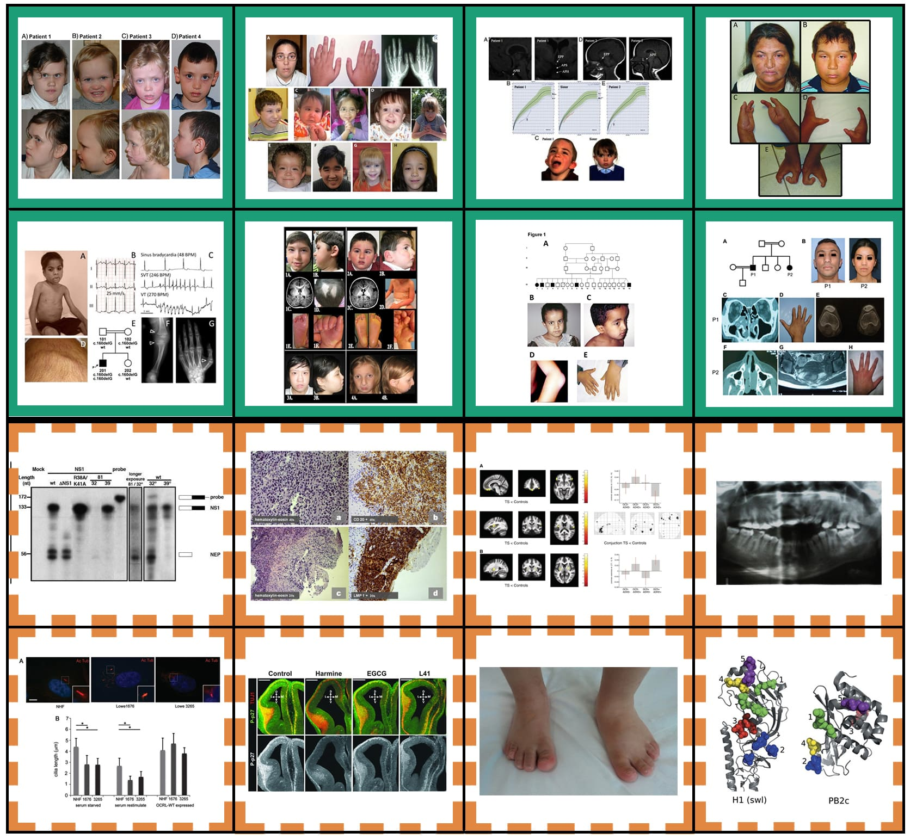

# Citations for images used in Figure 1

	

## Row 1

### Row 1, Column 1

Barøy, Tuva, et al. "Haploinsufficiency of two histone modifier genes on 6p22. 3, ATXN1 and JARID2, is associated with intellectual disability." Orphanet journal of rare diseases 8.1 (2013): 3.

Copyright © 2013 Barøy et al; licensee BioMed Central Ltd. This is an Open Access article distributed under the terms of the Creative Commons Attribution License ( http://creativecommons.org/licenses/by/2.0), which permits unrestricted use, distribution, and reproduction in any medium, provided the original work is properly cited.

Permission to re-use granted by Dr. Eirik Frengen, 28/7/17

### Row 1, Column 2

Mefford, Heather C., et al. "Further clinical and molecular delineation of the 15q24 microdeletion syndrome." Journal of medical genetics 49.2 (2012): 110-118.

Copyright © 2012, Published by the BMJ Publishing Group Limited. For permission to use (where not already granted under a licence) please go to http://group.bmj.com/group/rights-licensing/permissions. This is an open-access article distributed under the terms of the Creative Commons Attribution Non-commercial License, which permits use, distribution, and reproduction in any medium, provided the original work is properly cited, the use is non commercial and is otherwise in compliance with the license. See:http://creativecommons.org/licenses/by-nc/2.0/ and http://creativecommons.org/licenses/by-nc/2.0/legalcode.

Permission to re-use granted by Dr. Heather Mefford, 29/7/16

### Row 1, Column 3

Gregory, Louise C., et al. "Structural pituitary abnormalities associated with CHARGE syndrome." The Journal of Clinical Endocrinology & Metabolism98.4 (2013): E737-E743.

Copyright © 2013 by The Endocrine Society. This is an Open Access article distributed under the terms of the Creative Commons Attribution Non-Commercial License (http://creativecommons.org/licenses/by-nc/3.0/us/) which permits unrestricted non-commercial use, distribution, and reproduction in any medium, provided the original work is properly cited.

Permission to re-use granted by Prof. Mehul Dattani, 2/8/16

### Row 1, Column 4

Alves, Leandro Ucela, et al. "A novel c. 1037C> G (p. Ala346Gly) mutation in TP63 as cause of the ectrodactyly-ectodermal dysplasia and cleft lip/palate (EEC) syndrome." Genetics and molecular biology 38.1 (2015): 37-41.

Copyright © 2015, Sociedade Brasileira de Genética. This is an open-access article distributed under the terms of the Creative Commons Attribution License, which permits unrestricted use, distribution, and reproduction in any medium, provided the original work is properly cited.

Permission to re-use granted by Dr. Regina Mingroni Netto, 12/9/16 

## Row 2

### Row 2, Column 1

Rajab, Anna, et al. "Fatal cardiac arrhythmia and long-QT syndrome in a new form of congenital generalized lipodystrophy with muscle rippling (CGL4) due to PTRF-CAVIN mutations." PLoS genetics 6.3 (2010): e1000874.

Copyright Rajab et al. This is an open-access article distributed under the terms of the Creative Commons Attribution License, which permits unrestricted use, distribution, and reproduction in any medium, provided the original author and source are properly credited.

Permission to re-use granted by Prof. Dr. Markus Schülke, 19/7/17

### Row 2, Column 2

McDonald-McGinn, Donna M., et al. "Hemizygous mutations in SNAP29 unmask autosomal recessive conditions and contribute to atypical findings in patients with 22q11. 2DS." Journal of medical genetics (2012): jmedgenet-2012.

Copyright Published by the BMJ Publishing Group Limited. For permission to use (where not already granted under a licence) please go to http://group.bmj.com/group/rights-licensing/permissions. This is an open-access article distributed under the terms of the Creative Commons Attribution Non-commercial License, which permits use, distribution, and reproduction in any medium, provided the original work is properly cited, the use is non commercial and is otherwise in compliance with the license. See:http://creativecommons.org/licenses/by-nc/3.0/ and http://creativecommons.org/licenses/by-nc/3.0/legalcode

Permission to re-use granted by Dr. Loydie Jerome-Majewska, 28/7/16

### Row 2, Column 3

Ali, Bassam R., et al. "A mutation in KIF7 is responsible for the autosomal recessive syndrome of macrocephaly, multiple epiphyseal dysplasia and distinctive facial appearance." Orphanet journal of rare diseases 7.1 (2012): 27.

Copyright ©2012 Ali et al.; licensee BioMed Central Ltd. This is an Open Access article distributed under the terms of the Creative Commons Attribution License ( http:// http://creativecommons.org/licenses/by/2.0), which permits unrestricted use, distribution, and reproduction in any medium, provided the original work is properly cited.

Permission to re-use granted by Dr. Lihadh Al-Gazali, 28/7/17

### Row 2, Column 4

Bolze, Alexandre, et al. "A mild form of SLC29A3 disorder: a frameshift deletion leads to the paradoxical translation of an otherwise noncoding mRNA splice variant." PLoS One 7.1 (2012): e29708.

Copyright Bolze et al. This is an open-access article distributed under the terms of the Creative Commons Attribution License, which permits unrestricted use, distribution, and reproduction in any medium, provided the original author and source are credited.

Permission to re-use granted by Dr. Alexandre Bolze, 19/7/17

### Row 3, Column 1
### Row 3, Column 2
### Row 3, Column 3
### Row 3, Column 4

### Row 4, Column 1
### Row 4, Column 2
### Row 4, Column 3
### Row 4, Column 4